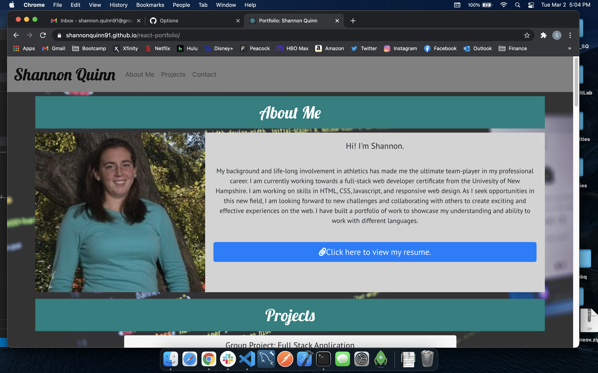

# React-Portfolio

11/13/2020:
After spending the last 8 weeks in the Coding Bootcamp, I have created a professional portfolio to showcase what I have learned and accomplished so far. I hope that this will help me when I start searching for jobs. As I continue to learn more and develop more skills, I will make updates to this porfolio to share with potential employers. 

1/29/21:
I have updated by professional portfolio to showcase the skills I have learned through four months of the Coding Bootcamp. I completed another group project which is a full-stack application. I plan to update this portfolio again as I reach the end of this course and share with potential employers. 

3/2/2021
After spending the last 3 weeks learning about React.js, I have transitioned by portfolio to a React project! I have also updated the projects I highlight on this page to include a React project. As I approach the end of this Coding Bootcamp, I plan on using this portfolio to display everything I have learned and hopefully gain employement.

Repo link: https://github.com/shannonquinn91/react-portfolio
Deployed Page link: https://shannonquinn91.github.io/react-portfolio/

